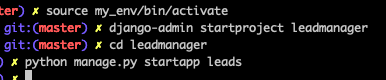
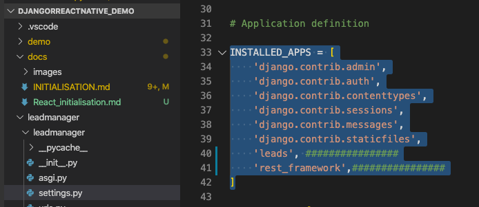
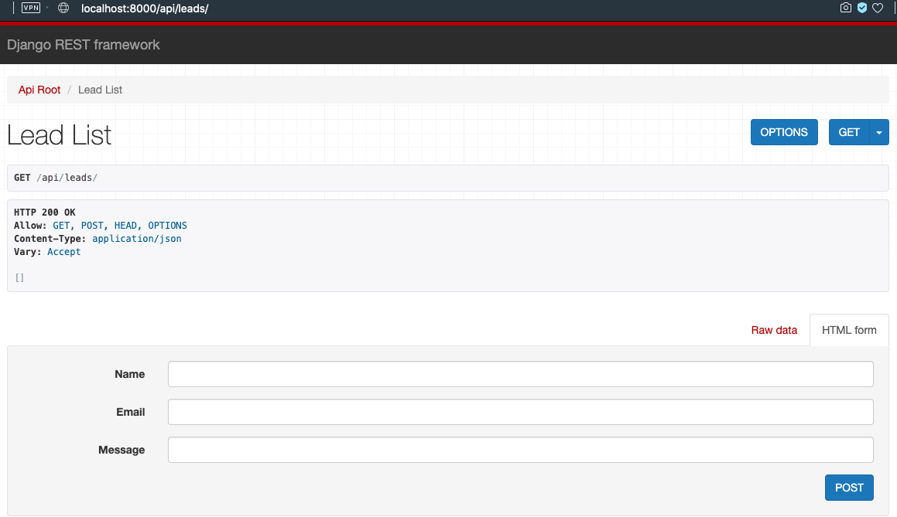
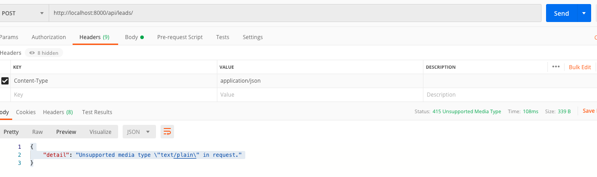
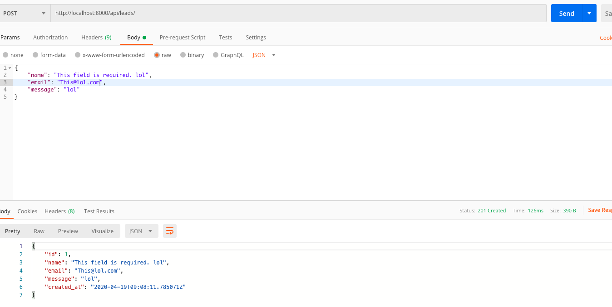

# djangoReactNative_demo
demo : django 3, react, react native, sql, heroku, firebase

## Django

```
python -m venv my_env
source my_env/bin/activate
pip install django djangorestframework django-rest-knox
```
1. Creation 



2. leadmanager/settings.py



3. leads/models.py

```
from django.db import models

class Lead(models.Model):
    name = models.CharField(max_length=99)
    email = models.EmailField(max_length=99, unique=True)
    message = models.CharField(max_length=255, blank=True)
    created_at = models.DateTimeField(auto_now_add=True)
```
RUN cmd :
> python manage.py makemigrations leads

```
(my_env) ➜ python manage.py makemigrations leads

Migrations for 'leads':
  leads/migrations/0001_initial.py
    - Create model Lead
```

> python manage.py migrate

```
(my_env) ➜ python manage.py migrate

Operations to perform:
  Apply all migrations: admin, auth, contenttypes, leads, sessions
Running migrations:
  Applying contenttypes.0001_initial... OK
...
  Applying sessions.0001_initial... OK
```


3. leads/serialiazer.py

create it :
```
from rest_framework import serializers
from leads.models import Lead


class LeadSerializer(serializers.ModelSerializer):
    class Meta:
        model = Lead
        fields = '__all__'
```

4. leads/api.py
create it :
```
from leads.models import Lead
from rest_framework import viewsets, permissions
from .serializers import LeadSerializer


# Lead viewset : CRUD -> (POST, GET, PUT, DELETE)
class LeadViewSet(viewsets.ModelViewSet):
    permission_classes = (permissions.AllowAny,)
    serializer_class = LeadSerializer
    queryset = Lead.objects.all()
```


5. urls - 2 x

leasmanager/urls.py
```
from django.contrib import admin
from django.urls import path, include

urlpatterns = [
    # path('admin/', admin.site.urls),
    path('', include('leads.urls')),
]
```

leasmanager/leads/urls.py
```
from rest_framework import routers
from .api import LeadViewSet

router = routers.DefaultRouter()
router.register('api/leads', LeadViewSet, 'leads')

urlpatterns = router.urls
```


run
> python manage.py runserver




###  Postman : POST

> http://localhost:8000/api/leads/


!!!
Don't forget :
Headers : content-type : application.json

otherwise : "detail":"Unsupported media type \"text/plain\" in request."






### GET :

> http://localhost:8000/api/leads/


> http://localhost:8000/api/leads/1


### DELETE

> http://localhost:8000/api/leads/2/


# frontend

[video](https://www.youtube.com/watch?v=GieYIzvdt2U)

in /leadmanager
````
python mananage.py startapp frontend
````

create folders :
- src/components
- static/frontend
- templates/frontend

## create react app

```
cd leadmanager
npx create-react-app frontend

yarn start
```


1. create Layout
create
src/components/Layout/Header.js
```
import React from 'react'

export default function Header() {
  return (
    <nav className="navbar navbar-expand-sm navbar-light bg-light">
      <a className="navbar-brand" href="#">Navbar</a>
      <button className="navbar-toggler" type="button" data-toggle="collapse" data-target="#navbarNav" aria-controls="navbarNav" aria-expanded="false" aria-label="Toggle navigation">
        <span className="navbar-toggler-icon"></span>
      </button>
      <div className="collapse navbar-collapse" id="navbarNav">
        <ul className="navbar-nav">
          <li className="nav-item active">
            <a className="nav-link" href="#">Home <span className="sr-only">(current)</span></a>
          </li>
        </ul>
      </div>
    </nav>
  )
}
```


import it in App.js
```
```
